# ColorM
ColorM is a header-only color conversion and manipulation library for [CSS colors](https://www.w3.org/TR/css-color-4/) with an API similar to [chroma.js](https://github.com/gka/chroma.js/)'s API. This library is released under [the Unlicense license](https://unlicense.org/).

## Table of contents
- [Usage](#usage)
- [Color classes](#color-classes)
    - [Constructors](#constructors)
    - [Setters and getters](#setters-and-getters)
    - [Alpha value](#alpha-value)
    - [Color string](#color-string)
    - [Clipping](#clipping)
	- [Manipulation](#manipulation)
	- [Manipulation in OKLCH color space](#manipulation-in-oklch-color-space)
	- [Comparison](#comparison)
	- [Blending](#blending)
	- [Operators](#operators)
- [Cubehelix](#cubehelix)
- [Color scale](#color-scale)
- [Color scale bezier](#color-scale-bezier)
- [Example](#example)

## Usage

You can copy the colorm.h file and add it to your project, and add the #include directive to the source file or precompiled header file.

```c++
#include "colorm.h"
```
## Color classes
This library defines [the following color classes](https://www.w3.org/TR/css-color-4/):
- Rgb: sRGB color (The maximum value for red, green, and blue is 255)
- Hsl: HSL color
- Hwb: HWB color
- Lrgb: Linear sRGB color
- XyzD50: CIE XYZ color using the D50 white point
- Lab: CIE L\*a\*b\* color
- Gray: Gray
- Lch: CIE LCh color
- XyzD65: CIE XYZ color using the D65 white point
- Oklab: OKLab color
- Oklch: OKLCH color
- Srgb: sRGB color (The maximum value for red, green, and blue is 1)
- DisplayP3: display-p3 color
- A98Rgb: a98-rgb color
- ProphotoRgb: prophoto-rgb color
- Rec2020: Rec.2020 color

### Constructors
Each color class has the following constructors:

*default constructor*

```c++
using namespace colorm;
Rgb rgb;
Oklab oklab;
```

*copy / move constructor*

```c++
using namespace colorm;
Rgb lightSeaGreen(32, 178, 170);
Rgb rgb(lightSeaGreen);
auto hsl = Hsl(Hsl(176.7, 69.5, 41.2));
```

*initialization*

```c++
using namespace colorm;
Rgb rgb(32, 178, 170);                             // red, green, blue[, alpha]
Hsl hsl(176.7, 69.5, 41.2);                        // hue, saturation, lightness[, alpha]
Hwb hwb(176.7, 12.6, 30.2);                        // hue, whiteness, blackness[, alpha]
Lrgb lrgb(0.01444, 0.4452, 0.40198);               // red, green, blue[, alpha]
XyzD50 xyzD50(0.235283, 0.34674, 0.330474);        // x, y, z[, alpha]
Lab lab(65.4941, -38.8301, -6.9185);               // lightness, a, b[, alpha]
Lch lch(65.4941, 39.4416, 190.1026);               // lightness, chroma, hue[, alpha]
XyzD65 xyzD65(0.237703, 0.350485, 0.435438);       // x, y, z[, alpha]
Oklab oklab(0.691201, -0.112819, - 0.017791);      // lightness, a, b[, alpha]
Oklch oklch(0.691201, 0.114213, 188.9617);         // lightness, chroma, hue[, alpha]
Srgb srgb(0.12549, 0.69804, 0.66667);              // red, green, blue[, alpha]
DisplayP3 displayP3(0.33347, 0.68787, 0.66405);    // red, green, blue[, alpha]
A98Rgb a98Rgb(0.40521, 0.69214, 0.66206);          // red, green, blue[, alpha]
ProphotoRgb prophotoRgb(0.42146, 0.60241, 0.6015); // red, green, blue[, alpha]
Rec2020 rec2020(0.39995, 0.64067, 0.62809);        // red, green, blue[, alpha]
```

*from c-string*

```c++
using namespace colorm;
try {
	Rgb rgb("lightseagreen");
	Hsl hsl("#20b2aa");
	Lrgb lrgb("lch(65.49% 39.44 190.1 / .4)");
	Oklab oklab("transparent"); // not supported
} catch (const ParseError& e) {
	std::cout << e.what() << std::endl; // transparent
}
```

*from string*

```c++
using namespace colorm;
try {
	Rgb rgb1(std::string("rgb(32, 178, 170)"));
	Rgb rgb2(std::string("currentcolor")); // not supported
} catch (const ParseError& e) {
	std::cout << e.what() << std::endl; // currentcolor
}
```

*from enum class Cn*

```c++
using namespace colorm;
Rgb rgb(Cn::Lightseagreen);
Oklch oklch(Cn::Lightseagreen, 0.4);
```

*from unsigned int*

```c++
using namespace colorm;
XyzD65 xyz1(0x20b2aa);
XyzD65 xyz2(0x20b2aa, 0.4);
```

*from another color class*

```c++
using namespace colorm;
Rgb color1(Hsl(176.7, 69.5, 41.2, 0.4)); // Hsl -> Rgb
Oklch color2(color1);                    // Rgb -> Oklch
```

### Setters and getters

Each color class has setters and getters:

```c++
using namespace colorm;
{
	Rgb rgb; // R:0-255 G:0-255 B:0-255
	rgb.setRed(55).setGreen(155).setBlue(255);
	std::cout << rgb.red() << ',' << rgb.green() << ',' << rgb.blue() << '\n';
	rgb.setRed8(55).setGreen8(155).setBlue8(255);
	std::cout << rgb.red8() << ',' << rgb.green8() << ',' << rgb.blue8() << '\n';
}{
	Hsl hsl; // H:0-360 S:0-1 L:0-1
	hsl.setHue(100).setSaturation(0.2).setLightness(0.3);
	std::cout << hsl.hue() << ',' << hsl.saturation() << ',' << hsl.lightness() << '\n';
}{
	Hwb hwb; // H:0-360 W:0-1 B:0-1
	hwb.setHue(100).setWhiteness(0.2).setBlackness(0.3);
	std::cout << hwb.hue() << ',' << hwb.whiteness() << ',' << hwb.blackness() << '\n';
}{
	Lrgb lrgb; // R:0-1 G:0-1 B:0-1
	lrgb.setRed(0.1).setGreen(0.2).setBlue(0.3);
	std::cout << lrgb.red() << ',' << lrgb.green() << ',' << lrgb.blue() << '\n';
}{
	XyzD50 xyz; // X:0-1 Y:0-1 Z:0-1
	xyz.setX(0.1).setY(0.2).setZ(0.3);
	std::cout << xyz.x() << ',' << xyz.y() << ',' << xyz.z() << '\n';
}{
	Lab lab; // L:0-100 A:? B:?
	lab.setLightness(30).setA(20).setB(10);
	std::cout << lab.lightness() << ',' << lab.a() << ',' << lab.b() << '\n';
}{
	Lch lch; // L:0-100 C:0-? H:0-360
	lch.setLightness(30).setChroma(20).setHue(100);
	std::cout << lch.lightness() << ',' << lch.chroma() << ',' << lch.hue() << '\n';
}{
	XyzD65 xyz; // X:0-1 Y:0-1 Z:0-1
	xyz.setX(0.1).setY(0.2).setZ(0.3);
	std::cout << xyz.x() << ',' << xyz.y() << ',' << xyz.z() << '\n';
}{
	Oklab klab; // L:0-1 A:? B:?
	klab.setLightness(0.3).setA(0.2).setB(0.1);
	std::cout << klab.lightness() << ',' << klab.a() << ',' << klab.b() << '\n';
}{
	Oklch klch; // L:0-1 C:0-? H:0-360
	klch.setLightness(0.3).setChroma(0.2).setHue(100);
	std::cout << klch.lightness() << ',' << klch.chroma() << ',' << klch.hue() << '\n';
}{
	Srgb srgb; // R:0-1 G:0-1 B:0-1
	srgb.setRed(0.1).setGreen(0.2).setBlue(0.3);
	std::cout << srgb.red() << ',' << srgb.green() << ',' << srgb.blue() << '\n';
}{
	DisplayP3 p3; // R:0-1 G:0-1 B:0-1
	p3.setRed(0.1).setGreen(0.2).setBlue(0.3);
	std::cout << p3.red() << ',' << p3.green() << ',' << p3.blue() << '\n';
}{
	A98Rgb argb; // R:0-1 G:0-1 B:0-1
	argb.setRed(0.1).setGreen(0.2).setBlue(0.3);
	std::cout << argb.red() << ',' << argb.green() << ',' << argb.blue() << '\n';
}{
	ProphotoRgb prgb; // R:0-1 G:0-1 B:0-1
	prgb.setRed(0.1).setGreen(0.2).setBlue(0.3);
	std::cout << prgb.red() << ',' << prgb.green() << ',' << prgb.blue() << '\n';
}{
	Rec2020 rec; // R:0-1 G:0-1 B:0-1
	rec.setRed(0.1).setGreen(0.2).setBlue(0.3);
	std::cout << rec.red() << ',' << rec.green() << ',' << rec.blue() << '\n';
}
```

### Alpha value

Each color class has the following functions:

- setAlpha() / alpha()

```c++
using namespace colorm;
Hsl hsl1(176.7, 69.5, 41.2);
std::cout << hsl1.alpha() << '\n'; // 1
Hsl hsl2(176.7, 69.5, 41.2, 0.4);
std::cout << hsl2.alpha() << '\n'; // 0.4
std::cout << std::boolalpha << (hsl1.setAlpha(0.4) == hsl2) << '\n'; // true
```

- isOpaque()

```c++
using namespace colorm;
std::cout << std::boolalpha
	<< Hsl(176.7, 69.5, 41.2).isOpaque() << '\n'                // true
	<< Hsl(176.7, 69.5, 41.2, 0.9951).isOpaque() << '\n'        // false
	<< Hsl(176.7, 69.5, 41.2, 0.9951).isOpaque(100.0) << '\n'   // true  (rounded to 1.0)
	<< Hsl(176.7, 69.5, 41.2, 0.9951).isOpaque(1000.0) << '\n'; // false (rounded to 0.995)
```

The Rgb class also has the following functions:

- setAlpha8() / alpha8()

```c++
using namespace colorm;
Rgb rgb(32, 178, 170, 0.4);
std::cout
	<< rgb.alpha8() << '\n'                 // 102 (== 255 * 0.4)
	<< rgb.setAlpha8(0xff).alpha() << '\n'; // 1
```


### Color string

Each color class has the following functions:

- vec(): returns a string for debugging
- hex(): returns a CSS hex color string specified in [CSS Color Module Level 3](https://www.w3.org/TR/2018/REC-css-color-3-20180619/) or [4](https://www.w3.org/TR/css-color-4/)
- name(): returns a CSS color name specified in [CSS Color Module Level 3](https://www.w3.org/TR/2018/REC-css-color-3-20180619/)
- name4(): returns a CSS color name specified in [CSS Color Module Level 3](https://www.w3.org/TR/2018/REC-css-color-3-20180619/) or [4](https://www.w3.org/TR/css-color-4/)
- css(): returns a CSS color string specified in [CSS Color Module Level 3](https://www.w3.org/TR/2018/REC-css-color-3-20180619/) or [4](https://www.w3.org/TR/css-color-4/)
- cssf():  more precise version of css()
- cssp():  returns a CSS color string expressed as percentages specified in [CSS Color Module Level 4](https://www.w3.org/TR/css-color-4/)

```c++
using namespace colorm;
Hsl hsl1(Cn::Lightseagreen, 0.8);
std::cout
	<< hsl1.vec()   << '\n' // (176.71232876712, 69.52380952381, 41.176470588235, 0.8)
	<< hsl1.hex()   << '\n' // #20b2aacc
	<< hsl1.name()  << '\n' // #20b2aacc
	<< hsl1.name4() << '\n' // #20b2aacc
	<< hsl1.css()   << '\n' // hsla(177, 70%, 41%, .8)
	<< hsl1.cssf()  << '\n' // hsla(176.7, 69.5%, 41.2%, .8)
	<< hsl1.cssp()  << '\n';// hsl(176.71 69.524% 41.176% / 80%)
Hsl hsl2(Cn::Lightseagreen);
std::cout
	<< hsl2.name()  << '\n' // lightseagreen
	<< hsl2.name4() << '\n';// lightseagreen
Hsl hsl3(Cn::Rebeccapurple);
std::cout
	<< hsl3.name()  << '\n' // #663399
	<< hsl3.name4() << '\n';// rebeccapurple
```

### Clipping

Each color class  has the following  functions:

- *clip(): returns a normalized color in this color space*
- *fit(): returns a color that can be displayed in sRGB with the same lightness as this color*

```c++
Rgb rgb1(255, 100, 0);
Rgb rgb2 = rgb1 + Rgb(50, 0, 0);
std::cout
	<< rgb2.vec()        // (305, 100, 0)
	<< " -- " << Oklab(rgb2).lightness() << '\n'        // -- 0.771162
	<< rgb2.clip().vec() // (255, 100, 0)
	<< " -- " << Oklab(rgb2.clip()).lightness() << '\n' // -- 0.69329
	<< rgb2.fit().vec()  // (254.9999486148, 147.19029028324, 113.4820791049)
	<< " -- " << Oklab(rgb2.fit()).lightness() << '\n'; // -- 0.771162
```
  

The Rgb class also has the following function:

- *round(): returns a RGBA color that has rounded red, green, and blue values*

```c++
using namespace colorm;
Rgb rgb1(254.4, 254.5, 255.5);
Rgb rgb2(-0.5, 0.4, 0.5);
std::cout
	<< rgb1.round().vec() << '\n'  // (254, 255, 255)
	<< rgb2.round().vec() << '\n'; // (0, 0, 1)
```

### Manipulation

Each color class has the following functions:

- *isDisplayable(): returns true if this color is displayable*

```c++
using namespace colorm;
std::cout << std::boolalpha
	<< Rgb(255, 100, 0).isDisplayable() << '\n' // true
	<< Rgb(256, 100, 0).isDisplayable() << '\n' // false
	<< Rgb(-1, 100, 0).isDisplayable() << '\n'; // false
```

- calculateLuminance(): returns the luminance of this color

```c++
using namespace colorm;
Hsl hsl1(Cn::White);
Hsl hsl2(56, 38, 58);
std::cout
	<< hsl1.calculateLuminance() << '\n'  // 1
	<< hsl2.calculateLuminance() << '\n'; // 0.457715
```

- maximizeLightness(): returns a color in the sRGB where one of the red, green, or blue values is about 255

```c++
using namespace colorm;
Rgb rgb1(189, 183, 107);
Rgb rgb2 = rgb1.maximizeLightness();
std::cout
	<< rgb1.vec() << '\n'  // (189, 183, 107)
	<< rgb2.vec() << '\n'; // (254.99996327663, 249.28216300176, 171.09735351009)
```
 

- mix(const T& t, double f = 0.5): returns a mixture of this color and another color

```c++
using namespace colorm;
Oklch color1(Cn::Orange);
Oklch color2(Cn::Olive);
Oklch color3 = color1.mix(color2, 0.25);
Oklch color4 = color1.mix(color2);
Oklch color5 = color1.mix(color2, 0.75);
std::cout
	<< color1.hex() << '\n'  // #ffa500
	<< color2.hex() << '\n'  // #808000
	<< color3.hex() << '\n'  // #dc9e00
	<< color4.hex() << '\n'  // #bc9500
	<< color5.hex() << '\n'; // #9d8b00
```
    

The Rgb class also has the following function:

- invert(): returns the inverted color of this color

```c++
using namespace colorm;
Rgb rgb(245, 205, 155);
Rgb invert = rgb.invert();
std::cout
	<< rgb.css() << '\n'     // rgb(245, 205, 155)
	<< invert.css() << '\n'; // rgb(10, 50, 100)
```
 

### Manipulation in [OKLCH color space](https://bottosson.github.io/posts/oklab/)

Each color class has the following functions:

- brighten(double f = 0.1): returns a color brighter than this color
- darken(double f = 0.1): returns a color darker than this color
- saturate(double f = 0.04): returns a color more saturated than this color
- desaturate(double f = 0.04): returns a color less saturated than this color
- rotate(double f = 36.0): returns a color with a rotated hue of this color
- flip(double f = 0.0) const noexcept*: returns a color with a flipped hue of this color
```c++
using namespace colorm;
Rgb rgb(Cn::Skyblue);
std::cout
	<< rgb.css()                  << '\n' // rgb(135, 206, 235)
	<< rgb.brighten(0.1).css()    << '\n' // rgb(189, 235, 255)
	<< rgb.darken(0.1).css()      << '\n' // rgb(103, 174, 202)
	<< rgb.saturate(0.04).css()   << '\n' // rgb(92, 210, 254)
	<< rgb.desaturate(0.04).css() << '\n' // rgb(167, 201, 215)
	<< rgb.rotate(36.0).css()     << '\n' // rgb(165, 195, 248)
	<< rgb.flip(0.0).css()        << '\n';// rgb(173, 207, 153)
```


 

 

 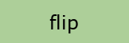

- grayscale() const noexcept: returns a color converted to grayscale for this color

```c++
using namespace colorm;
Rgb orange(Cn::Orange);
Rgb gray = orange.grayscale();
std::cout
	<< orange.hex() << '\n'  // #ffa500
	<< gray.hex()   << '\n'; // #bbbbbb
```
 

### Comparison

- deltaE_00(const T&): returns the [CIEDE2000](https://en.wikipedia.org/wiki/Color_difference#CIEDE2000) color difference between this color and another color
- deltaE(const T&): returns the [deltaE OK](https://www.w3.org/TR/css-color-4/#color-difference-OK) color difference between this color and another color
- distance(const T&): returns [the Euclidean distance](https://en.wikipedia.org/wiki/Euclidean_distance) between this color and another color
- contrast(const T&): returns [the WCAG contrast ratio](https://www.w3.org/TR/WCAG20-TECHS/G18.html) of this color to another color

```c++
using namespace colorm;
Rgb rgb1(100, 100, 100);
Rgb rgb2(105, 100, 88);
Rgb rgb3(105, 100, 88, 0.5);
std::cout
	<< rgb1.deltaE_00(rgb2) << '\n'  // 6.49336
	<< rgb1.deltaE(rgb2)    << '\n'  // 0.019541
	<< rgb1.contrast(rgb2)  << '\n'  // 1.00442
	<< rgb1.distance(rgb2)  << '\n'  // 13
	<< rgb2.distance(rgb3)  << '\n'; // 0
```

### Blending

The blending formulas are adapted from [the Compositing and Blending Level 1 specification](https://www.w3.org/TR/compositing-1/).

The Rgb class has the following functions:
- blendNormal(const Rgb&)
- blendMultiply(const Rgb&)
- blendDarken(const Rgb&)
- blendLighten(const Rgb&)
- blendScreen(const Rgb&)
- blendOverlay(const Rgb&)
- blendColorDodge(const Rgb&)
- blendColorBurn(const Rgb&)
- blendHardLight(const Rgb&)
- blendSoftLight(const Rgb&)
- blendDifference(const Rgb&)
- blendExclusion(const Rgb&)
- blendHue(const Rgb&)
- blendSaturation(const Rgb&)
- blendColor(const Rgb&)
- blendLuminosity(const Rgb&)


```c++
using namespace colorm;
Rgb source(0x336699);
Rgb backdrop(0x993366);
std::cout
	<< source.blendNormal(backdrop).hex()     << '\n'  // #336699
	<< source.blendMultiply(backdrop).hex()   << '\n'  // #1f143d
	<< source.blendDarken(backdrop).hex()     << '\n'  // #333366
	<< source.blendLighten(backdrop).hex()    << '\n'  // #996699
	<< source.blendScreen(backdrop).hex()     << '\n'  // #ad85c2
	<< source.blendOverlay(backdrop).hex()    << '\n'  // #5c297a
	<< source.blendColorDodge(backdrop).hex() << '\n'  // #bf55ff
	<< source.blendColorBurn(backdrop).hex()  << '\n'  // #000000
	<< source.blendHardLight(backdrop).hex()  << '\n'  // #3d2985
	<< source.blendSoftLight(backdrop).hex()  << '\n'  // #742b72
	<< source.blendDifference(backdrop).hex() << '\n'  // #663333
	<< source.blendExclusion(backdrop).hex()  << '\n'  // #8f7085
	<< source.blendHue(backdrop).hex()        << '\n'  // #2e6194
	<< source.blendSaturation(backdrop).hex() << '\n'  // #993366
	<< source.blendColor(backdrop).hex()      << '\n'  // #2e6194
	<< source.blendLuminosity(backdrop).hex() << '\n'; // #9e386b
```
 

   

   

   

   

### Operators

Each color class has the following comparison, arithmetic, and assignment operators:
- ==
- !=
- \<
- \>
- \<=
- \>=
- \+
- \-
- \*
- /
- +=
- -=
- \*=
- /=

```c++
using namespace colorm;
Rgb rgb1(12.3, 45.6, 78.9);
Rgb rgb2(0.5, 0.5, 0.5, 0.5);
std::cout << std::boolalpha
	<< (rgb1 == rgb2)        << '\n'  // false
	<< (rgb1 != rgb2)        << '\n'  // true
	<< (rgb1 < rgb2)         << '\n'  // false
	<< (rgb1 > rgb2)         << '\n'  // true
	<< (rgb1 <= rgb2)        << '\n'  // false
	<< (rgb1 >= rgb2)        << '\n'  // true
	<< (rgb1 + rgb2).vec()   << '\n'  // (12.8, 46.1, 79.4)
	<< (rgb1 + rgb2).alpha() << '\n'  // 1.5
	<< (rgb1 - rgb2).vec()   << '\n'  // (11.8, 45.1, 78.4, 0.5)
	<< (rgb1 * rgb2).vec()   << '\n'  // (6.15, 22.8, 39.45, 0.5)
	<< (rgb1 / rgb2).vec()   << '\n'  // (24.6, 91.2, 157.8)
	<< (rgb1 / rgb2).alpha() << '\n'; // 2
```

## Cubehelix

This library supports [Dave Green's `cubehelix' colour scheme](http://www.mrao.cam.ac.uk/~dag/CUBEHELIX/).

### Constructor

- Cubehelix(double start = 0.5, double rotations = -1.5, double hue = 1.0, double gamma = 1.0)


### Setters

- setStart(double start = 0.5)

- setRotations(double rotations = -1.5)

- setHue(double hue = 1.0)

- setGamma(double gamma = 1.0)


### Functions

- operator()(double fract): returns the RGB color associated with the number fract

```c++
using namespace colorm;
Cubehelix cu;
for (int i = 0; i < 24; ++i) {
	double d = static_cast<double>(i) / 23.0;
	std::cout << ((i % 8) ? ' ' : '\n') << cu(d).hex();
}
// #000000 #100713 #19112a #1a1f3d #18314a #15454e #17574a #206740
// #337336 #4e792f #6e7b31 #907a3e #ae7956 #c57a76 #d1809a #d48bbc
// #d09bd7 #c9aeea #c3c2f2 #c2d5f3 #c9e5f0 #d7f1ef #ebf9f3 #ffffff
```
          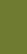 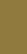 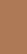 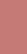  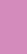 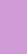  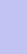     

## Color scale

ColorScale is a class template that implements linear interpolation between colors.

### Constructors and getters

- Scale(std::initializer_list\<const char\*\> colors_)
- Scale(std::initializer_list\<const char\*\> colors_, const std::vector\<double\>& domain_)
- Scale(const std::vector\<T\>& colors_)
- Scale(const std::vector\<T\>& colors_, const std::vector\<double\>& domain_)
- getColorList(): returns the color list
- getDomain(): returns the input domain

```c++
using namespace colorm;
try {
	ColorScale<Rgb> cs1({"rgb(128,128,0)", "black"});
	ColorScale<Rgb> cs2({"rgb(128,128,0)", "black", "#ffc0cb"}, {0.0, 0.5, 2.0});
	std::cout << std::boolalpha
		<< (cs1.getColorList() == std::vector<Rgb>{Rgb(128, 128, 0), Rgb(0, 0, 0)}) << '\n' // true
		<< (cs1.getDomain() == std::vector<double>{0.0, 1.0}) << '\n'; // true
} catch (const ParseError& e) {
	std::cerr << e.what() << std::endl;
}
Rgb olive(Cn::Olive), black(Cn::Black), pink(Cn::Pink);
ColorScale<Rgb> cs3({olive, black});
ColorScale<Rgb> cs4({olive, black, pink}, {0.0, 0.5, 2.0});
std::cout << std::boolalpha
	<< (cs3.getColorList() == std::vector<Rgb>{olive, black}) << '\n' // true
	<< (cs3.getDomain() == std::vector<double>{0.0, 1.0}) << '\n'; // true
```

### Functions

- operator()(double f, double gamma = 1.0): returns the color associated with the number f
- colors(int n, double gamma = 1.0): returns the generated n colors

```c++
using namespace colorm;
Oklab olive(Cn::Olive), yellow(Cn::Yellow), pink(Cn::Pink);
ColorScale<Oklab> cs({olive, yellow, pink}, {0.0, 1.0 / 3.0, 1.0});

std::cout << std::fixed << std::setprecision(2);
for (int i = 0; i < 5; ++i) {
	double d = static_cast<double>(i) / 4.0;
	std::cout << "(" << d << ") " << cs(d).hex() << ' ';
}
// (0.00) #808000 (0.25) #dede00 (0.50) #fff06a (0.75) #ffd9a2 (1.00) #ffc0cb
std::cout << std::defaultfloat << std::setprecision(15) << std::endl;

std::vector<Oklab> c = cs.colors(5);
for (int i = 0; i < 5; ++i) {
	std::cout << "c[" << i << "] " << c[i].hex() << ' ';
}
// c[0] #808000 c[1] #dede00 c[2] #fff06a c[3] #ffd9a2 c[4] #ffc0cb
```
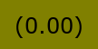 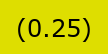 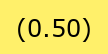 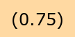 

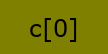 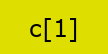 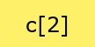 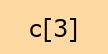 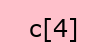

To applay [the hue interpolation strategy](https://www.w3.org/TR/css-color-4/#hue-interpolation):

- shorter() / shorter(int index)
- longer() / longer(int index)
- increasing() / increasing(int index)
- decreasing() / decreasing(int index)

```c++
using namespace colorm;
Oklch shu(0xed514e), ruri(0x3451a4);
ColorScale<Oklch> cs({shu, ruri, shu});
std::cout << "shorter:           ";
for (const auto& c : cs.shorter().colors(9)) std::cout << ' ' << c.hex();
std::cout << "\nlonger:            ";
for (const auto& c : cs.longer().colors(9)) std::cout << ' ' << c.hex();
std::cout << "\nincreasing:        ";
for (const auto& c : cs.increasing().colors(9)) std::cout << ' ' << c.hex();
std::cout << "\ndecreasing:        ";
for (const auto& c : cs.decreasing().colors(9)) std::cout << ' ' << c.hex();
std::cout << "\nshorter and longer:";
for (const auto& c : cs.shorter(0).longer(1).colors(9)) std::cout << ' ' << c.hex();
std::cout << std::endl;
// shorter:            #ed514e #ce4785 #a249a6 #6f4db0 #3451a4 #6f4db0 #a249a6 #ce4785 #ed514e
// longer:             #ed514e #a17a00 #0d8a2d #00737d #3451a4 #00737d #0d8a2d #a17a00 #ed514e
// increasing:         #ed514e #a17a00 #0d8a2d #00737d #3451a4 #6f4db0 #a249a6 #ce4785 #ed514e
// decreasing:         #ed514e #ce4785 #a249a6 #6f4db0 #3451a4 #00737d #0d8a2d #a17a00 #ed514e
// shorter and longer: #ed514e #ce4785 #a249a6 #6f4db0 #3451a4 #00737d #0d8a2d #a17a00 #ed514e
```
         

  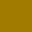       

         

         

- correctLightness(): returns a color scale in OKLab with smoothly changing brightness

```c++
using namespace colorm;
ColorScale<Rgb> cs1({"black", "red", "orange", "lightyellow"});
ColorScale<Oklab> cs2 = cs1.correctLightness();
std::cout << "original: ";
for (const auto& c : cs1.colors(10)) std::cout << ' ' << c.hex();
std::cout << "\ncorrected:";
for (const auto& c : cs2.colors(10)) std::cout << ' ' << c.hex();
std::cout << std::endl;
// original:  #000000 #550000 #aa0000 #ff0000 #ff3700 #ff6e00 #ffa500 #ffc34b #ffe195 #ffffe0
// corrected: #000000 #110000 #3b0000 #6b0000 #8f2d00 #af5600 #c88100 #e4a851 #f3d49b #ffffe0
```
    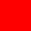 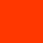    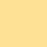 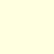

      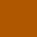  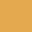  

## Color scale bezier

ColorScaleBezier is a class that implements bezier interpolation between colors in [OKLab color space](https://bottosson.github.io/posts/oklab/).

### Constructors and getters

- Bezier(std::initializer_list\<const char\*\> cl)*
- Bezier(std::initializer_list\<const char\*\> cl, const std::array\<double, 2\>& dl)
- Bezier(const std::vector\<LabD65\>& cl)
- Bezier(const std::vector\<LabD65\>& cl, const std::array\<double, 2\>& dl)
- getColorList(): returns the color list
- getDomain(): returns the input domain

```c++
using namespace colorm;
try {
	ColorScaleBezier be1({"yellow", "red", "black"});
	ColorScaleBezier be2({"black", "yellow", "red", "black"}, {0.0, 2.0});
	std::cout << std::boolalpha
		<< (be1.getColorList()
			== std::vector<Oklab>{Oklab(Cn::Yellow), Oklab(Cn::Red), Oklab(Cn::Black)}) << '\n' // true
		<< (be1.getDomain() == std::array<double, 2>{0.0, 1.0}) << '\n'; // true
} catch (const ParseError& e) {
	std::cerr << e.what() << std::endl;
}
Oklab yellow(Cn::Yellow), red(Cn::Red), black(Cn::Black);
ColorScaleBezier be3({yellow, red, black});
ColorScaleBezier be4({black, yellow, red, black}, {0.0, 2.0});
std::cout << std::boolalpha
	<< (be3.getColorList() == std::vector<Oklab>{yellow, red, black}) << '\n' // true
	<< (be3.getDomain() == std::array<double, 2>{0.0, 1.0}) << '\n'; // true
```

### Functions

- operator()(double f, double gamma = 1.0): returns the color associated with the number f
- colors(int n, double gamma = 1.0): returns the generated n colors

```c++
using namespace colorm;
Oklab orenge(Cn::Orange), yellow(Cn::Yellow), green(Cn::Green);
ColorScaleBezier be({orenge, yellow, green});
std::cout << std::fixed << std::setprecision(2);
for (int i = 0; i < 7; ++i) {
	double d = static_cast<double>(i) / 6.0;
	std::cout << "(" << d << ") " << be(d).hex() << ' ';
}
// (0.00) #ffa500 (0.17) #fbbe00 (0.33) #eaca00 (0.50) #ccc900 (0.67) #a1bc00 (0.83) #68a400 (1.00) #008000
std::cout << std::defaultfloat << std::setprecision(15) << std::endl;

std::vector<Oklab> c = be.colors(7);
for (int i = 0; i < 7; ++i) {
	std::cout << "c[" << i << "] " << c[i].hex() << ' ';
}
// c[0] #ffa500 c[1] #fbbe00 c[2] #eaca00 c[3] #ccc900 c[4] #a1bc00 c[5] #68a400 c[6] #008000
```
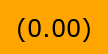 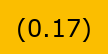 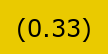 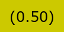 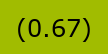  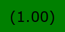

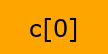 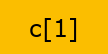 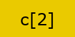 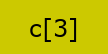   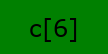

## Example

Here is an example program that replaces each color string in a file with another color string:
```c++
#include "colorm.h"
#include <fstream>
#include <streambuf>
#include <regex>

std::string readFile(const char* const filename)
{
	std::ifstream f(filename);
	if (!f) return std::string();
	return std::string(
		(std::istreambuf_iterator<char>(f)),
		std::istreambuf_iterator<char>());
}

std::string toPastelColor(const std::string& color)
{
	try {
		colorm::Oklch c(color);
		if (c.chroma() > 0.06) {
			c.setChroma(0.12).setLightness(0.8);
		} else {
			c.setChroma(0.0);
		}
		return colorm::Hsl(c).css();
	} catch (const colorm::ParseError& e) {
		return std::string(e.what());
	}
}

void convertAndWriteColor(std::ofstream& o, const std::string& str)
{
	static const std::regex reg(R"(#?[%\-/0-9A-Za-z]+(?:\([^)]*\))?)");
	std::smatch m;
	auto ci = str.cbegin();
	const auto ce = str.cend();
	while (std::regex_search(ci, ce, m, reg)) {
		o << std::string(ci, ci + m.position(0));
		o << toPastelColor(m.str(0));
		ci += m.position(0) + m.length(0);
	}
	o << std::string(ci, ce);
}

int main()
{
	const std::string str = readFile("A.html");
	std::ofstream o("B.html");
	const std::regex reg(R"((?:background|border|color)\s*:\s*([^:;<=>\{\}]+))", std::regex_constants::icase);
	std::smatch m;
	auto ci = str.cbegin();
	const auto ce = str.cend();
	while (std::regex_search(ci, ce, m, reg)) {
		o << std::string(ci, ci + m.position(1));
		convertAndWriteColor(o, m.str(1));
		ci += m.position(0) + m.length(0);
	}
	o << std::string(ci, ce);
}
```
This program can convert *A.html* to *B.html*:

*A.html*

```html
<span style="font-size: 64px; color: slategray;">*</span>
<span style="font-size: 64px; color: rgb(255, 80, 100);">Z</span>
<span style="font-size: 64px; color: #FEA510;">Z</span>
<span style="font-size: 64px; color: hsl(65, 80%, 50%);">Z</span>
```


*B.html*

```html
<span style="font-size: 64px; color: hsl(0, 0%, 49%);">*</span>
<span style="font-size: 64px; color: hsl(359, 100%, 81%);">Z</span>
<span style="font-size: 64px; color: hsl(33, 81%, 66%);">Z</span>
<span style="font-size: 64px; color: hsl(68, 46%, 60%);">Z</span>
```

